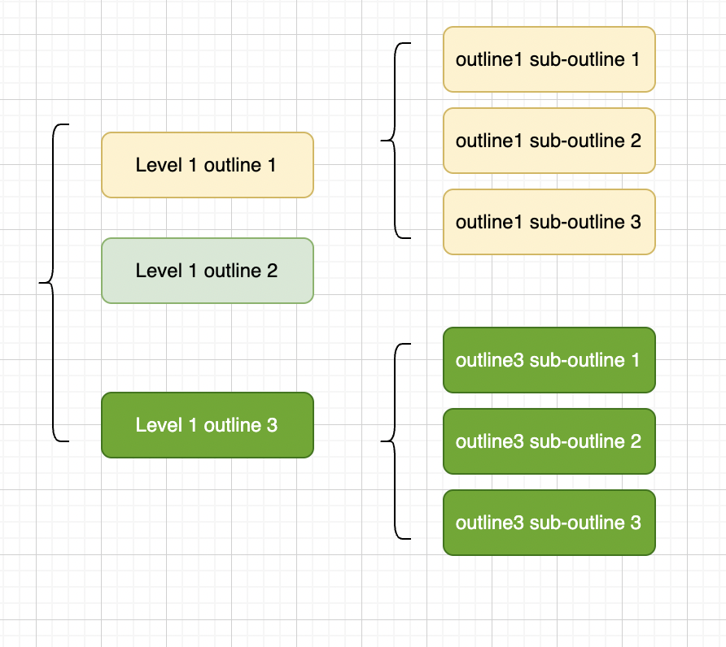

# 1. Coding is Writing

这两年在写业务逻辑, java&spring, 终于理解了传说中的业务逻辑的可怕. 简而言之, 代码混乱, 逻辑耦合. 这不是部分程序员的问题, 而是一个行业的现象. 经过长时间的调研, 我做了一些总结和尝试, 提出一种新的代码组织方式, 可以非常有力地改善代码的可读性, 和代码结构的合理程度.

## Readability Kills
业务逻辑开发和系统开发, 有很大的区别. 因为系统本身, 是一个完整的体系, 所以工程师可以更好的获得完整的理解, 进行完善的设计; 而业务逻辑的开发, 需求是不断变化, 并且大多数时候, 只能有一些侧写, 或者临时的方案. 换句话说: 业务系统中, 属于系统的部分, 优先被工程师解决了, 剩下的都是难以系统化的部分.

因为业务逻辑原生缺少"系统性", 又不断变化, 可能"认真写了一星期, 刚上线就要删掉", 而且还要赶时间, 被deadline不断催, 所以工程师习惯用"不做设计"的方式, 把业务逻辑堆叠在代码中, 一切以快速上线为目的, 怎么方便怎么写. 这种情况不断迭代, 造就了"丑陋并且难以维护"的业务逻辑.

//TODO: 需要一张图

业务逻辑代码长期的混乱, 又让工程师接受了这种糟糕的"培训", 于是情况变得愈发糟糕. 

## Writing Code for Read
这种情况需要改变. 业务不是在写完代码的时候完成的, 在整个代码的生命周期里, 会有很多人去维护这些代码. 所以业务逻辑的代码, 需要更加清晰, **可读性必须要放到第一位**.

同时, 因为业务逻辑的代码, 会跟随需求的变化, 进行各种尝试, 所以不仅要让当下的代码清晰可读, 还要提供一种机制, 使得代码, 在经过起业务需求的捶打之后, 还能保持很好的可读性.

## Pick Ideas from Slides

"你问我, 世界上可读性最好的资料在哪里? 我把答案抛向蓝天落在PPT里."

为什么slides是可读性最好的? 教授讲课用它, 介绍知识; 企业家用它, 寻找VC; 老板用它, 判断谁能升职加薪. 这个世界上最重要的, 知识, 财富, 前途, 都用slides, 为什么? 因为slides的核心, 就是让听众理解它, 所以可读性就是slides的根本.

**Outlines**
几乎所有的slides, 都会在封面之后, 就给出提纲. 然后按照提纲讲解细节.

提纲的用处, 自然是概括整个slides. 通过提纲, 读者就可以立刻了解整个讲稿的结构和内容的梗概, 获得良好的'全局观'. 

对比日常的业务代码, 我们可以得到如下结果

|  | Slides | Common Business Code |
| -- | -- | -- |
| Outlines | Always outlines before going to detail | N/A |

**Simple Sequenceial Flow for Mind**
几乎所有的编程语言, 都会有几种控制流的转换: 分支, 循环, 异常.  
slides只使用从头到尾的平铺直叙. 哪怕需要回顾前面的内容, 它也是采用把要回顾的内容, 复制到下一页. 所有这些只有一个目的: 让读者, 更顺畅的理解. 避免打断读者的思路, 避免造成思路的跳跃. 

|  | Slides | Code |
| -- | -- | -- |
| Flow | Simple Sequenceial Flow | Complex Code Flow |
| Flow Graph| ||

## The End
当我们切换到阅读代码的角度, 来看待写代码. 似乎一条隐藏的线索渐渐清晰: 写代码, 也是一种写作. 

